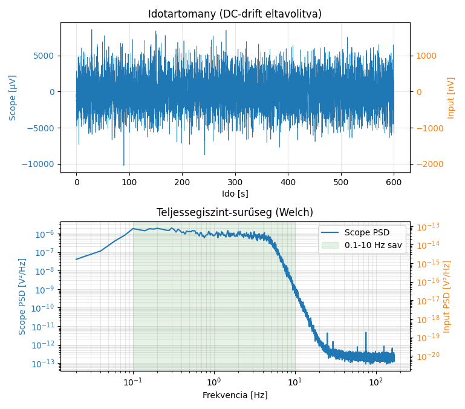
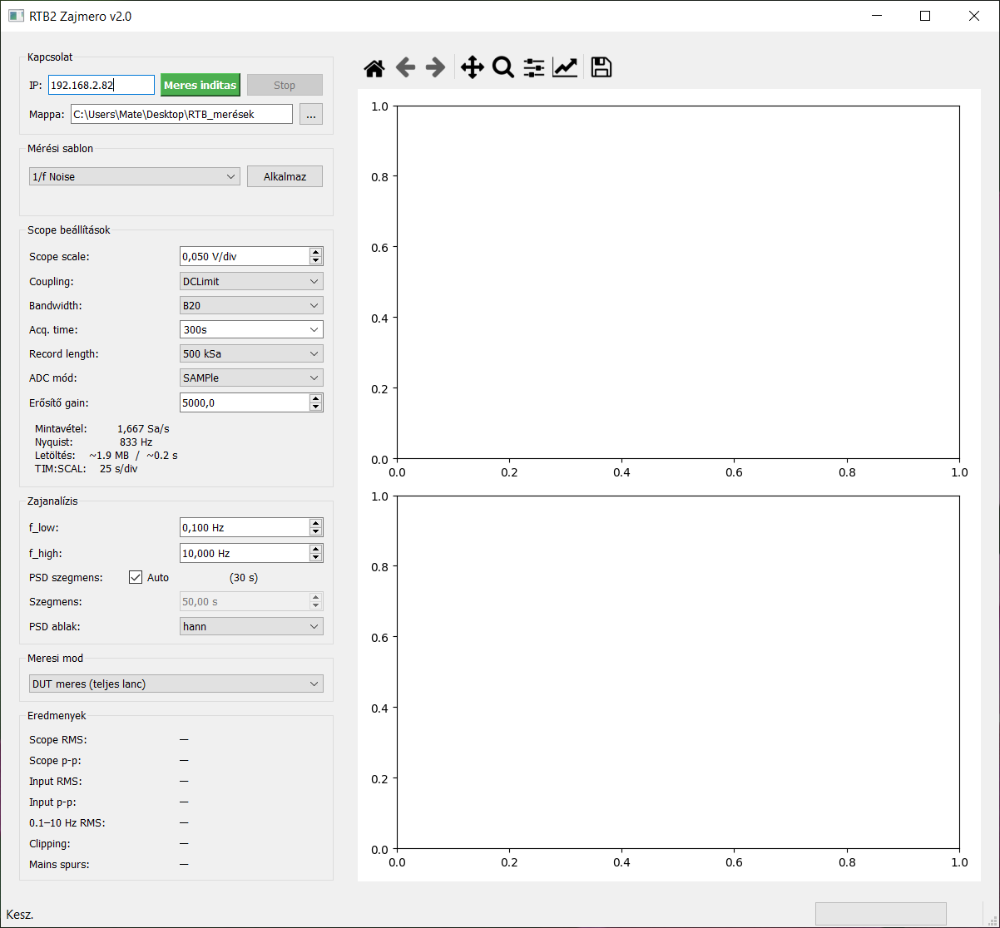

# RTB2_Zajmero – R&S RTB2002 1/f zajmérő

Rohde & Schwarz RTB2002 oszcilloszkóp vezérlő program 1/f zajmérésekhez.
LAN-on (TCP/IP) csatlakozik a műszerhez, hullámformát tölt le, majd a helyen
elvégzi a zajanalízist: ASD spektrum, integrált RMS zaj, spur detekció.





## Mérési módok

A program három különböző jelöléssel tud mérést indítani, amelyek együtt teljes
képet adnak a mért DUT zajáról:

| Mód | Jelölés | Leírás |
|-----|---------|--------|
| DUT mérés | **DUT meres (teljes lanc)** | Teljes mérési lánc — erősítő + DUT |
| Erősítő zaj | **Erosito zaj (DUT nelkul)** | Erősítő zárt bemenettel, DUT nélkül — kontrol |
| Scope kontrol | **Input shorted (scope csak)** | Oszcilloszkóp saját zaja — alap kontrol |

A három mérés egymásra vetítve megmutatja, hogy az eredmény mennyiben az erősítő
vagy az oszcilloszkóp zajából, és mennyiben a DUT-ból ered.

## Presetlek

| Preset | Sáv | Idő | ADC mód |
|--------|-----|-----|---------|
| 1/f Noise | 0,1–10 Hz | 300 s | HRESolution |
| PSU Standard Ripple | 10 Hz–100 kHz | 1 s | SAMPle |
| PSU Wideband | 100 Hz–5 MHz | 0,1 s | SAMPle |
| Burst Capture | 1 Hz–50 MHz | 10 ms | SAMPle |
| Long Trend | 0,01–1 Hz | 1000 s | HRESolution |
| Custom | — | — | egyedi |

## Elemzési funkciók

- Welch ASD (amplitúdó spektrális sűrűség, V/√Hz)
- Integrált RMS zaj az f_low–f_high sávban
- Clipping detekció
- Hálózati spurok (50 Hz, felharmonikusok) azonosítása
- Parseval-ellenőrzés (spektrum-idő konzisztencia)
- Scope RMS / p-p és visszaszámolt bemeneti RMS / p-p (gain alapján)

## Csatlakozás

Az oszcilloszkóp LAN porton keresztül csatlakozik, PyVISA-py segítségével —
nincs szükség NI-VISA vagy egyéb gyártói driver telepítésére.

| Paraméter | Érték |
|-----------|-------|
| Protokoll | TCP/IP (LAN) |
| Alapértelmezett IP | 192.168.2.82 |
| Vezérlő könyvtár | PyVISA + pyvisa-py |

## Követelmények

```
pip install -r requirements.txt
```

```
numpy>=1.24
scipy>=1.10
pyvisa>=1.13
pyvisa-py>=0.6
PyQt5>=5.15
matplotlib>=3.7
```

## Futtatás

```bat
python gui.py
```

## Build (önálló exe)

```bat
build.bat
```

Kimenet: `dist\RTB2_zajmero.exe`
